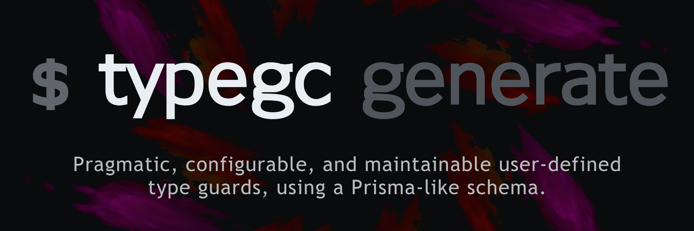

---

> TypeGC is a small TypeScript tool that allows you, as a developer, to have a more productive experience by writing useful and meaningful code, not wasting time on writing boring repetitive type guards.

<small>Looking for the <a href="https://cursorsdottsx.github.io/typegc/docs/">documentation</a>?</small>

## Getting started

To get started with TypeGC, first install it. You can install it globally as a global CLI, or locally if you want to use it in your programs.
It's probably best to install both, as you'll need the CLI to compile your schemas.

**Globally**

```bash
$ npm install -g typegc
```

**Locally**

```bash
$ npm install typegc
```

```bash
$ yarn add typegc
```

Inside your new project, use `typegc init` to create a basic schema.

```bash
$ typegc init
```

Now go to `typegc/schema.typegc` and start creating your first schema!
Refer to the [documentation](https://cursorsdottsx.github.io/typegc/docs/) anytime you get stuck, or for a complete reference of the syntax and standard library.

After you hack together a schema, compile it with `typegc generate`!

```bash
$ typegc generate
```

Finally, you can use the generated type guards in your code.

```ts
/**
 * isMyType - Type guard
 * MyType   - Interface
 */

import { isMyType, MyType } from "typegc";

isMyType(someObject); // => true/false
```

TypeGC also supports interpreting schemas at runtime.

```ts
import typegc from "typegc";

typegc(mySchema).MyType(someObject); // => true/false
```

TypeGC schema parser created with only TypeScript types coming soon™️.

## What's this?

TypeGC was created when I got a little inspiration after I read a few messages in [The Coding Den](https://discord.gg/code)'s TypeScript channel.
The question was whether or not there was an easier way to make maintainable type guards for raw API data.
For example, if I have an interface called `APIError`, and another interface, similar in structure, called `UserError`, and I want a type guard to tell me if a value is an `APIError`, don't I need to check the value extensively to be absolutely sure that the value is in fact an `APIError` and not a `UserError`?

<details>
    <summary>Example code</summary>

```ts
/* First interface, named UserError */
interface UserError {
    status: number;
    message: string;
    endpoint: string;
    error: {
        message: string;
        stack: string;
    };
}

/**
 * Second interface, named APIError.
 * It's the same as UserError, and it's named differently because of:
 * - Semantics
 * - The data it will hold (status, for example, will hold different ranges of codes)
 * - Context
 */
interface APIError {
    status: number;
    message: string;
    endpoint: string;
    error: {
        message: string;
        stack: string;
    };
}

function manual(v: any): v is APIError {
    return (
        typeof v === "object" &&
        v &&
        typeof v["status"] === "number" &&
        v["status"] >= 400 &&
        v["status"] <= 599 &&
        typeof v["message"] === "string" &&
        typeof v["endpoint"] === "string" &&
        /(\/[^\/]*)+/.test(v["endpoint"]) &&
        typeof v["error"] === "object" &&
        v["error"] &&
        typeof v["message"] === "string" &&
        typeof v["stack"] === "string"
    );
}
```

</details>

Agh! What a nightmare to maintain! The documentation and implementations will all differ across developers and platforms!

Fortunately, there is something we can do to minimize the amount of ambiguity involved, which is obviously a single source of truth.
In TypeGC, our single source of truth, is of course the schema.

<details>
    <summary>Example schema</summary>

```txt
config {
  strict true
}

alias UserCode  range(400, 499)
alias ErrorCode range(400, 599)

define ErrorObject {
  message string
  stack   string
}

model UserError {
    status   number      UserCode
    message  string
    endpoint string      match("/users/([^/]*)+")
    error    ErrorObject
}

model APIError {
  status   number      ErrorCode
  message  string
  endpoint string      match("(/[^/]*)+")
  error    ErrorObject
}
```

</details>

From this schema, TypeGC will compile it to a set of JavaScript functions, and TypeScript type declarations to go along with them.

<details>
    <summary>Generated JavaScript</summary>

```js
/**
 * typegc - Type Guard Compiler
 *
 * version 1.0.0
 *
 * AUTO-GENERATED FILE DO NOT EDIT DIRECTLY
 */

/**
 * config
 * {
 *     "strict": true
 * }
 */

/**
 * globals
 */
var _;
const mainArray$ErrorObject = [
    (v) => array$ErrorObject$message0.every((fn) => fn(v["message"])) /* string */,
    (v) => array$ErrorObject$stack1.every((fn) => fn(v["stack"])) /* string */,
];
const array$ErrorObject$message0 = ((retrieve$string) => {
    let cached$string;
    const string = () => cached$string ?? (cached$string = retrieve$string());
    return [(v) => string().every((fn) => fn(v)) /* string */];
})(() => string);
const array$ErrorObject$stack1 = ((retrieve$string) => {
    let cached$string;
    const string = () => cached$string ?? (cached$string = retrieve$string());
    return [(v) => string().every((fn) => fn(v)) /* string */];
})(() => string);
const UserError$endpoint4 = new RegExp("/users/([^/]*)+");
const mainArray$UserError = [
    (v) => array$UserError$status2.every((fn) => fn(v["status"])) /* number | string */,
    (v) => array$UserError$message3.every((fn) => fn(v["message"])) /* string */,
    (v) => array$UserError$endpoint5.every((fn) => fn(v["endpoint"])) /* string */,
    (v) => array$UserError$error6.every((fn) => fn(v["error"])) /* ErrorObject */,
];
const array$UserError$status2 = ((retrieve$number, retrieve$UserCode) => {
    let cached$number;
    const number = () => cached$number ?? (cached$number = retrieve$number());
    let cached$UserCode;
    const UserCode = () => cached$UserCode ?? (cached$UserCode = retrieve$UserCode());
    return [(v) => number().every((fn) => fn(v)) /* number */, (v) => UserCode().every((fn) => fn(v)) /* string | number */];
})(
    () => number,
    () => UserCode
);
const array$UserError$message3 = ((retrieve$string) => {
    let cached$string;
    const string = () => cached$string ?? (cached$string = retrieve$string());
    return [(v) => string().every((fn) => fn(v)) /* string */];
})(() => string);
const array$UserError$endpoint5 = ((retrieve$string) => {
    let cached$string;
    const string = () => cached$string ?? (cached$string = retrieve$string());
    return [(v) => string().every((fn) => fn(v)) /* string */, (v) => UserError$endpoint4.test(v) /* string */];
})(() => string);
const array$UserError$error6 = ((retrieve$ErrorObject) => {
    let cached$ErrorObject;
    const ErrorObject = () => cached$ErrorObject ?? (cached$ErrorObject = retrieve$ErrorObject());
    return [ErrorObject /* ErrorObject */];
})(() => ErrorObject);
const APIError$endpoint9 = new RegExp("(/[^/]*)+");
const mainArray$APIError = [
    (v) => array$APIError$status7.every((fn) => fn(v["status"])) /* number | string */,
    (v) => array$APIError$message8.every((fn) => fn(v["message"])) /* string */,
    (v) => array$APIError$endpoint10.every((fn) => fn(v["endpoint"])) /* string */,
    (v) => array$APIError$error11.every((fn) => fn(v["error"])) /* ErrorObject */,
];
const array$APIError$status7 = ((retrieve$number, retrieve$ErrorCode) => {
    let cached$number;
    const number = () => cached$number ?? (cached$number = retrieve$number());
    let cached$ErrorCode;
    const ErrorCode = () => cached$ErrorCode ?? (cached$ErrorCode = retrieve$ErrorCode());
    return [(v) => number().every((fn) => fn(v)) /* number */, (v) => ErrorCode().every((fn) => fn(v)) /* string | number */];
})(
    () => number,
    () => ErrorCode
);
const array$APIError$message8 = ((retrieve$string) => {
    let cached$string;
    const string = () => cached$string ?? (cached$string = retrieve$string());
    return [(v) => string().every((fn) => fn(v)) /* string */];
})(() => string);
const array$APIError$endpoint10 = ((retrieve$string) => {
    let cached$string;
    const string = () => cached$string ?? (cached$string = retrieve$string());
    return [(v) => string().every((fn) => fn(v)) /* string */, (v) => APIError$endpoint9.test(v) /* string */];
})(() => string);
const array$APIError$error11 = ((retrieve$ErrorObject) => {
    let cached$ErrorObject;
    const ErrorObject = () => cached$ErrorObject ?? (cached$ErrorObject = retrieve$ErrorObject());
    return [ErrorObject /* ErrorObject */];
})(() => ErrorObject);

/**
 * aliases
 */
var _;
const string = [(v) => typeof v === "string" /* string */];
const number = [(v) => typeof v === "number" /* number */];
const boolean = [(v) => typeof v === "boolean" /* boolean */];
const bigint = [(v) => typeof v === "bigint" /* bigint */];
const symbol = [(v) => typeof v === "symbol" /* symbol */];
const UserCode = [
    (v) => {
        if (499 <= 400) return new RangeError(`Stop parameter must be greater than the start parameter in the range factory.`);

        if (typeof v === "string") return v.length >= 400 && v.length <= 499;

        return v >= 400 && v <= 499;
    } /* string | number */,
];
const ErrorCode = [
    (v) => {
        if (599 <= 400) return new RangeError(`Stop parameter must be greater than the start parameter in the range factory.`);

        if (typeof v === "string") return v.length >= 400 && v.length <= 599;

        return v >= 400 && v <= 599;
    } /* string | number */,
];

/**
 * definitions
 */
var _;
const ErrorObject = (v) => mainArray$ErrorObject.every((fn) => fn(v));

/**
 * models
 */
var _;
export const isUserError = (v) => mainArray$UserError.every((fn) => fn(v));

export const isAPIError = (v) => mainArray$APIError.every((fn) => fn(v));
```

</details>

<details>
    <summary>Generated types</summary>

```ts
/**
 * typegc - Type Guard Compiler
 *
 * version 1.0.0
 *
 * AUTO-GENERATED FILE DO NOT EDIT DIRECTLY
 */

/**
 * config
 * {
 *     "strict": true
 * }
 */

/**
 * type aliases
 */
declare var _: never;

type UserCode = string | number;
type ErrorCode = string | number;

/**
 * interfaces
 */
declare var _: never;
interface ErrorObject {
    message: string;
    stack: string;
}

/**
 * exported interfaces
 */
declare var _: never;
export interface UserError {
    status: number | string;
    message: string;
    endpoint: string;
    error: ErrorObject;
}
export interface APIError {
    status: number | string;
    message: string;
    endpoint: string;
    error: ErrorObject;
}

/**
 * type guards
 */
declare var _: never;
export declare const isUserError: (v: unknown) => v is UserError;

export declare const isAPIError: (v: unknown) => v is APIError;
```

  </details>
    
## More features
    
There's more about TypeGC in case you missed it:
    
- Standard library of factories
- Import user-defined components
- Plugin system for extensibility
- Fast compilation and interpreting

**Performance benchmarks (nanoseconds on example code and schema earlier)**

-   Manual: 138ns
-   TypeGC (interpreted): 413ns
-   TypeGC (compiled): 237ns

## When should I use it?

Well, when you want to, I guess. But here's some cases when I would and wouldn't.

I would use TypeGC if:

-   I'm making an API with many interfaces to represent entities, and I need type guards for them.
-   I have too many type guards that are complex and hard to maintain.

I wouldn't use TypeGC if:

-   It isn't worth the extra build step for the added amount of convenience.

It's up to you, whether or not it's worth it to use TypeGC!

## Contributing

The following is totally not copied from [CONTRIBUTING.md](./CONTRIBUTING.md):

Well I'm really flattered that you're even reading this, even more so if you are actually going to contribute.

I'd like to say a few words about contributing.

-   You should use our prettier formatter config to enforce code style
-   Use TypeScript; JavaScript contributions will be immediately shunned :)
-   Follow the really simple code of conduct we have here
-   Be cool 😎 Peace out ✌️

## Acknowledgements

-   [Aryn](https://github.com/arynxd/) - cocreator of TypeGC, in a way
-   [Cassie](https://github.com/BobobUnicorn/) - great insight, feedback and design solutions
-   ~~[Okku](https://github.com/0kku) - memey posts on discord~~
